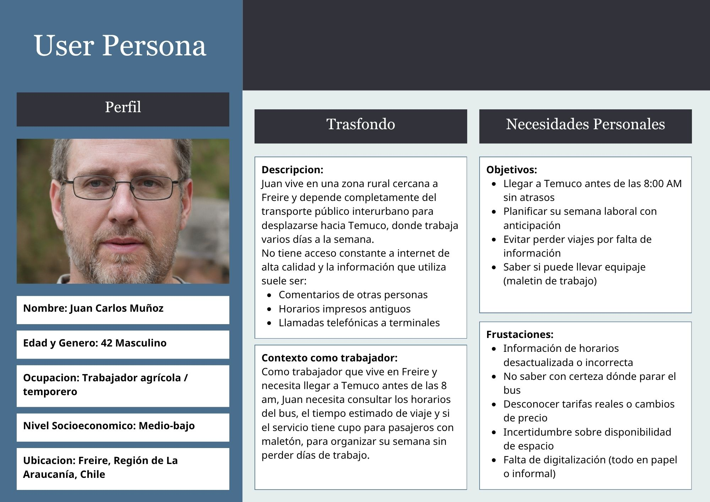
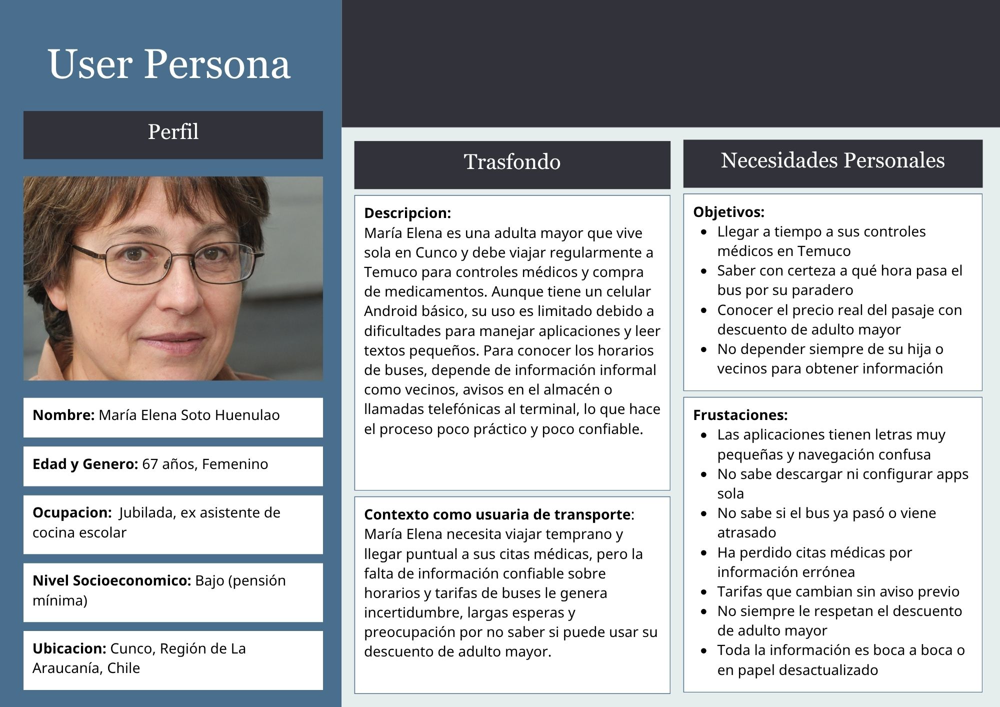
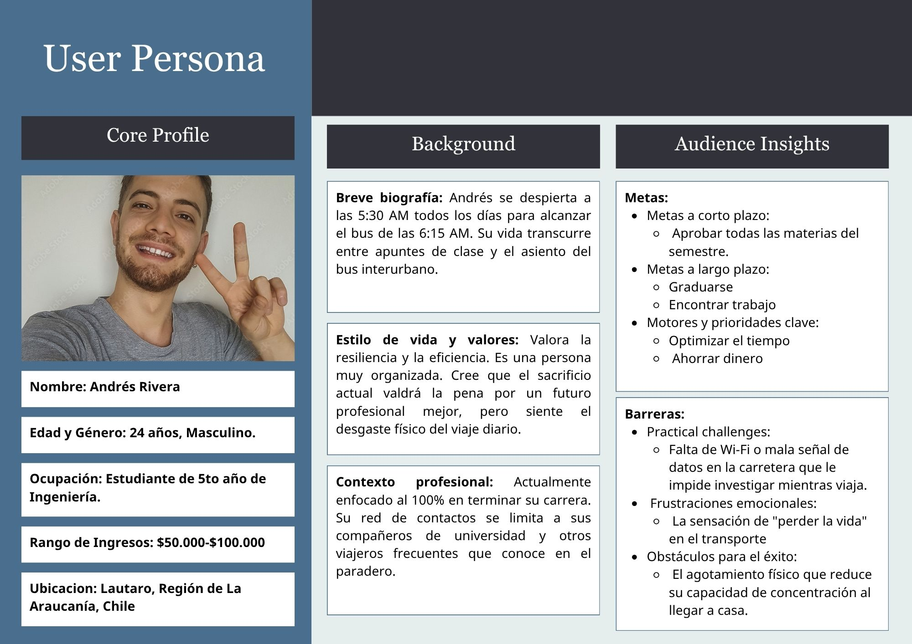

# Vocación360 UXD
User Experience Design for Vocación360: A Vocational Guidance Platform for High School Students in Chile

## Index

- [1. Introduction](#1-introduction)
  - [1.1. The Problem](#11-the-problem)
  - [1.2. Our Solution](#12-our-solution)
- [2. Team & Roles](#2-team--roles)
- [3. Strategy](#3-strategy)
  - [3.1. Value Proposition Canvas](#31-value-proposition-canvas)
  - [3.2. UX Personas](#32-ux-personas)
  - [3.3. Benchmarking](#33-benchmarking)
- [4. Scope](#4-scope)
  - [4.1 Customer Journey Map](#41-customer-journey-map)
    - [4.1.1 Decision Stage Interfaces](#411-decision-stage-interfaces)
- [5. Structure](#5-structure)
  - [5.1. Navigation Flow](#51-navigation-flow)
- [6. Skeleton](#6-skeleton)
  - [6.1. Low-Fi Wireframes](#62-low-fi-wireframes)
- [7. Surface](#z7-surface)
  - [7.1. Interface Evolution](#71-ui-evolution)
  - [7.2. Results of the Heuristic Evaluation](#72-results-of-the-heuristic-evaluation)
  - [7.3. High Definition Interfaces](#73-high-definition-interfaces)

---

## 1. Introduction

### 1.1. **The Problem**

The Araucanía region faces a critical mobility challenge: thousands of people in rural localities depend exclusively on urban transportation to access essential services—education, healthcare, and employment opportunities—concentrated in major cities.

However, information about routes, schedules, fares, and transportation availability remains **fragmented, decentralized, and often available only in physical format**. This information gap creates **significant uncertainty** that disproportionately affects students and workers in rural areas, limiting their mobility, access to opportunities, and quality of life.

**The result: a rural population disconnected, lacking the information needed to plan their travel effectively.**

---

### 1.2. **Our Solution**

Our proposal consists of designing an intuitive mobile interface that serves as a bridge between bus operators and rural passengers in the Araucanía region. A user-centered solution that transforms the travel experience from the moment a trip is planned to the moment of arrival.
 
The proposal is built around four pillars designed to address our users' core pain points:
 
- **Real-time information hub.** Users access a clear, accessible interface that allows them to check updated schedules, estimated arrival times, and the operational status of each bus—including mechanical breakdowns. This eliminates the uncertainty that currently forces people to wait at bus stops with no assurance whatsoever, enabling them to plan their journey ahead of time, reduce the anxiety of waiting, and track their arrival time in real time.
 
- **Capacity and luggage management.** The platform provides real-time visibility into seat availability and luggage space. This directly addresses the frustration of arriving at a bus stop only to find the bus is full: users can reserve their spot and secure space for their luggage before leaving home, regaining control over their mobility.
 
- **Fare transparency and payment digitization.** The solution incorporates an advance-purchase system that automatically calculates and applies preferential fares—student, senior—without users losing these benefits due to lack of awareness or failure to carry physical documentation. This reduces queues at terminals, decreases cash dependency, and eliminates the friction rural passengers currently face when paying.
 
- **Smart notifications.** The application sends proactive alerts to the user's device regarding delays, route changes, or newly available seats. Rather than discovering a problem upon arrival at the bus stop, the system anticipates it, empowering users to make informed decisions and reorganize their day in time.

---

## 2. Team & Roles

**Angelo Huaiquil** - *Project Manager*

**Gustavo Pérez** - *Analyst*

**Daniela Díaz** - *Designer*

[PONER A ALGUIEN O BORRAR] - *Presenter*

---

## 3. Strategy - First Layer

### 3.1. Value Proposition Canvas

[FALTA TEXTO]

***

### 3.2. **UX Personas**  

[FALTA TEXTO]

---

👥🔹 **Juan Carlos Muñoz (42, Male)**
*Agricultural worker from Freire who depends entirely on intercity buses to commute to Temuco. He relies on outdated printed schedules and word-of-mouth, and faces constant uncertainty about bus times, fares, and luggage capacity.*

👥🔹 **Maria Elena Soto Huenulao (67, Female)** 
*Retired senior living alone in Cunco who travels regularly to Temuco for medical appointments. She struggles with small text and confusing app navigation, and has missed appointments due to unreliable bus information.*  

👥🔹 **Andres Rivera (24, Male)** 
*5th-year Engineering student from Lautaro who wakes at 5:30 AM daily to catch the 6:15 bus. He values efficiency and time optimization but feels physically drained by the daily commute and lack of reliable transit data.*

---

### 3.3. Benchmarking 

---

## 4. Scope - Second Layer

### 4.1. Customer Journey Map

---

## 5. Structure - Third Layer

### 5.1. Navigation Flow

---

## 6. Skeleton - Fourth Layer

### 6.1. Low-fidelity wireframes

---

## 7. Surface - Fifth Layer

### 7.1. Interface Evolution

### 7.2. Results of the Heuristic Evaluation

### 7.3. High Definition Interfaces

---
---

## 8. Annex

### 3. Strategy Documents

### 4. Scope Documents

### 5. Structure Documents

### 6. Skeleton Documents

### 7. Surface Documents

---