# BusFinder UXD
Connecting rural Araucanía to reliable transit, one tap at a time
https://canva.link/v55iex59ethmrx6

> **Progress Presentation I:** [BusFinder - Presentación Avance 1 (PDF)](./Docs/BusFinder%20-%20Presentacion%20Avanze%201.pdf)
> 
> **Progress Presentation FINAL:** [BusFinder Final Version](./Docs/BusFinder%20Presentacion%20Final.pdf)

> **Figma · Low-Fi Wireframes:** [Open in Figma](https://www.figma.com/design/ZrcgdOga1rsxqB9vF9FUYD/BusFinder-UIX?node-id=0-1&p=f&t=BQZNktzbyAsyNEaS-0)
>
> **Figma · High-Fidelity Interfaces:** [Open in Figma](https://www.figma.com/design/ZrcgdOga1rsxqB9vF9FUYD/BusFinder-UIX?node-id=298-159&p=f&t=BQZNktzbyAsyNEaS-0)
>
> **Figma · Changes & Iterations (feedback):** [Open in Figma](https://www.figma.com/design/ZrcgdOga1rsxqB9vF9FUYD/BusFinder-UIX?node-id=765-1106&p=f&t=BQZNktzbyAsyNEaS-0)

## Index

- [1. Team Members and Roles](#1-team-members-and-roles)
- [2. Introduction](#2-introduction)
  - [2.1. The Problem](#21-the-problem)
  - [2.2. Our Solution](#22-our-solution)
- [3. The Strategy](#3-the-strategy)
  - [3.1. Value Proposition Canvas](#31-value-proposition-canvas)
  - [3.2. UX Personas](#32-ux-personas)
- [4. The Scope](#4-the-scope)
  - [4.1. Benchmarking](#41-benchmarking)
- [5. The Structure](#5-the-structure)
  - [5.1. Navigation Flow](#51-navigation-flow)
- [6. The Skeleton](#6-the-skeleton)
  - [6.1. Low-Fidelity Wireframes](#61-low-fidelity-wireframes)
- [7. The Surface](#7-the-surface)
  - [7.1. Interface Evolution](#71-interface-evolution)
  - [7.2. High-Fidelity Interfaces](#72-high-fidelity-interfaces)
- [8. Results of the Heuristic Evaluation](#8-results-of-the-heuristic-evaluation)
  - [8.1. Tutor's Evaluation](#81-tutors-evaluation)
  - [8.2. Heuristic Evaluation](#82-heuristic-evaluation)
- [9. Accessibility](#9-accessibility)
- [10. Conclusion](#10-conclusion)

---

## 1. Team Members and Roles

**Angelo Huaiquil** - *Project Manager*
*Coordinates the team, plans deliverables, and keeps the project aligned with its goals, scope, and deadlines.*

**Gustavo Pérez** - *Analyst*
*Researches users and requirements, leads benchmarking, and turns findings into actionable product insights.*

**Daniela Díaz** - *Designer*
*Shapes the UX/UI: personas, wireframes, navigation flows, and high-fidelity interfaces.*

---

## 2. Introduction

### 2.1. **The Problem**

In the Araucanía region, getting around is a daily struggle. Thousands of people in rural towns rely entirely on interurban buses and *micros* to reach the services they need most, education, healthcare, and work, nearly all of which are concentrated in Temuco and other larger cities.

The trouble is that information about routes, schedules, stops, and fares is scattered, hard to find, and often only exists on paper. That gap leaves people guessing, and it hits seniors, students, and rural workers the hardest, narrowing their options and making everyday life harder than it should be.

> *"As a worker living in Freire who needs to reach Temuco before 8 a.m., I need to check bus schedules, the estimated travel time, and whether the service has room for passengers with large luggage, so I can plan my week without losing days of work."*

The result is a rural population left disconnected, without the information they need to plan a trip with any confidence.

---

### 2.2. **Our Solution**

We set out to build a mobile app that bridges the gap between bus operators and rural passengers in the Araucanía region. The idea is simple: put the traveler at the center and make the whole journey easier, from the first bit of planning to the moment they arrive.

The design rests on four pillars, each one answering a real frustration our users described:

- **Real-time information.** A clear, easy-to-read screen where people can check current schedules, estimated arrival times, and how each bus is doing, breakdowns included. No more waiting at a stop with no idea whether the bus is coming; travelers can plan ahead and follow their bus as it approaches.

- **Seats and luggage at a glance.** The app shows how many seats and how much luggage space are left, so nobody arrives at the stop only to find a full bus. Travelers can book their spot and reserve room for their bags before they even leave home.

- **Clear fares and digital payment.** People can buy ahead of time, and the app works out preferential fares (student, senior) on its own, so no one loses a discount for forgetting a card or document. That means shorter lines, less cash, and far less friction when it's time to pay.

- **Smart notifications.** The app gives users a heads-up about delays, route changes, or seats that just opened up. Instead of finding out the hard way at the bus stop, they hear about it in time to rearrange their day.

---

## 3. The Strategy

### 3.1. Value Proposition Canvas

The Value Proposition Canvas lines up what rural and intercity bus users in Araucanía actually need against what BusFinder offers.

On the customer side are passengers trying to make it to work, school, or a medical appointment on time, while never quite knowing the schedules, the fares, how much luggage room there is, or whether a bus will even have space. Their biggest frustrations come down to unreliable and scattered schedule info, unclear fares, luggage trouble, and delays nobody warned them about.

BusFinder answers each of those with real-time alerts, estimated travel times, visible seat and luggage availability, clear prices that already include any discount, and push notifications when a bus runs late or a seat frees up. The point is to take the guesswork out of traveling, make trips easier to plan, and open the experience up to rural passengers, students, workers, and seniors alike.

***

### 3.2. **UX Personas**  

To keep our decisions grounded in real people, we built three personas from the users most affected by rural and intercity mobility in Araucanía. Each one reflects a different comfort level with technology, a different travel routine, and a different degree of reliance on public transport.

They kept us honest throughout the project, reminding us why reliable route info, readable screens, clear fares, timely alerts, and less uncertainty matter so much, and they shaped the features we chose to prioritize: live tracking, seat and luggage visibility, transparent fares, and proactive notifications.

Between them, they cover three everyday situations: commuting to work, traveling for medical care, and getting to and from university.

---

👥🔹 **Juan Carlos Muñoz (42, Male)**
*Agricultural worker from Freire who depends entirely on intercity buses to commute to Temuco. He relies on outdated printed schedules and word-of-mouth, and faces constant uncertainty about bus times, fares, and luggage capacity.*

---

👥🔹 **Maria Elena Soto Huenulao (67, Female)**
*Retired senior living alone in Cunco who travels regularly to Temuco for medical appointments. She struggles with small text and confusing app navigation, and has missed appointments due to unreliable bus information.*

---

👥🔹 **Andres Rivera (24, Male)**
*5th-year Engineering student from Lautaro who wakes at 5:30 AM daily to catch the 6:15 bus. He values efficiency and time optimization but feels physically drained by the daily commute and lack of reliable transit data.*

---

## 4. The Scope

### 4.1. Benchmarking

We looked at TurBus, Moovit, and Uber to learn which mobility patterns could work for BusFinder. TurBus is the closest reference for buying intercity tickets and choosing seats; Moovit shows how to handle route planning, live guidance, and service alerts; and Uber sets the bar for map-based tracking, ETAs, and clear pricing.

From there we decided what BusFinder should lean into: a search-first flow, easy route comparison, real-time or estimated tracking, transparent fares, and visible seat and luggage space. The benchmark was just as useful for spotting what to stay away from, like intrusive ads, forcing people to sign up before they can do anything, hiding luggage info, and cluttered navigation.

We ran the benchmark in two stages, a broad first exploration and then a focused head-to-head comparison. The annotated screenshots of TurBus, Moovit, and Uber, with our notes on what to borrow and what to skip, live in the Benchmark BusFinder PDF. What you'll find here is the distilled output of that work: the feature (idea) map and the comparative summary tables below.

**Full benchmark document:** [Benchmark BusFinder](./Docs/Benchmark%20BusFinder.pdf)

#### Feature Map

#### Comparative Summary Table

---

## 5. The Structure

### 5.1. Navigation Flow

The site map below lays out BusFinder's main areas and how people move between them: search, the live map, managing trips, profile, payment, identity verification, and support.

---

## 6. The Skeleton

### 6.1. Low-Fidelity Wireframes

The low-fidelity wireframes capture the core screens and the paths people take to plan, choose, pay for, manage, and change a trip in BusFinder.

The preview above shows three representative wireframes; the full set is in the PDF and Figma links below.

Here's what each of the main screens is for at this stage:

- **Main Menu (Home):** a map-centered home that makes search the way into the app.
- **Search Trip (Buscar viaje):** origin and destination, departure date and time, and quick access to popular routes.
- **Search Results (Resultados):** a scannable list of trips with times and fares, so options are easy to compare.
- **Buy Ticket (Comprar pasaje):** the purchase path, from picking a seat to entering passenger details and paying.
- **Ticket Detail (Detalle pasaje):** the issued ticket with all the trip info, plus the options to change the schedule or seat, or cancel.
- **My Tickets (Mis viajes):** the user's trips, split into upcoming, history, and cancelled.

These paper sketches locked in the layout, what mattered most on each screen, and the main interaction paths before we moved into higher fidelity.

**Low-fi wireframes document:** [Low-Fi Wireframes - PDF](./Docs/Low-Fi%20Wireframes.pdf)

**Figma file:** [Low-Fi Wireframes - Figma](https://www.figma.com/design/ZrcgdOga1rsxqB9vF9FUYD/BusFinder-UIX?node-id=0-1&p=f&t=BQZNktzbyAsyNEaS-0)

---

## 7. The Surface

The surface layer is where BusFinder really takes shape. It covers the visual design, color, typography, iconography, spacing, and components, and the step that turns those rough wireframes into finished, high-fidelity screens. This is where the look, the feel, and the overall experience of the app come together.

Every high-fidelity screen is built from a shared, reusable set of components and leans on familiar UI conventions: one consistent palette and type scale, reusable buttons, inputs, cards, badges, and steppers, and a bottom navigation that's always within reach. Color carries meaning here, purple for primary actions and red for the destructive ones, and repeating patterns like stepped flows, confirmation screens, and success states keep the whole app predictable and easy to follow.

**Figma file:** [BusFinder UIX - High-Fidelity Interfaces](https://www.figma.com/design/ZrcgdOga1rsxqB9vF9FUYD/BusFinder-UIX?node-id=298-159&p=f&t=BQZNktzbyAsyNEaS-0)

### 7.1. Interface Evolution

Here we walk through how each screen changed, from the first rough idea to the final design. Broadly, every screen passed through three stages: hand-drawn sketches that set the layout and decided what mattered most, grayscale wireframes that tightened the structure and interaction patterns, and high-fidelity screens that brought in BusFinder's visual identity, the purple accent, consistent type and icons, real content, and a persistent bottom navigation. The rundown below covers the key change on each screen.

#### Main Menu (Home)

The home started as a rough sketch, just a placeholder map and a couple of floating buttons. It then became a proper wireframe built around a map with a search bar on top, and finally a polished, map-first home with an interactive map and a clear "¿A dónde viajas?" search. Search ended up as the heart of the screen.

#### Search Trip (Buscar Viaje)

The search form began with simple From/To, date, and time fields. The wireframe added a swap control and a shortcut to popular routes, and the final version brought a friendly "Planifica tu viaje" heading, pre-filled fields, a clear purple action button, popular routes you can tap, and the bottom navigation.

#### Search Results (Resultados de Búsqueda)

Results went from a plain stack of trips to proper, comparable cards. Along the way we added filtering and sorting and richer cards (company, route, times, price), and the final design put the price front and center while keeping everything easy to scan.

#### Buy Ticket (Comprar Pasaje)

We split buying a ticket into clear steps. What started as a cramped sequence (trip data with a seat grid, a passenger form, and a payment screen) became a clean flow: plan the trip, pick a seat, enter passenger details, then pay and confirm, with a visual seat map, tidier forms, and a payment summary that lists the available methods.

#### My Tickets (Mis Viajes)

The trips list grew from a plain list into a screen with tabs (Próximas / Historial / Cancelados) and detailed cards, ending in a polished version with a clear action on each trip ("Ver pasaje") and a quick "Buscar otro viaje" link.

#### Ticket Detail (Detalle Pasaje)

The ticket detail started as a plain list of fields with "Anular/Cambiar" buttons. The wireframe added a QR boarding code and reserved-space info, and the final screen organized everything into a clean detail list with a seat badge and color-coded actions: purple for changes, red for cancelling.

#### Home Notifications (Notificaciones)

Smart notifications show up right on the map home and shift with the situation: a heads-up alert, a delay warning, then an arrival confirmation, each colored by how urgent it is and paired with a clear action, so users stay in the loop without leaving the home screen.

There's plenty more where this came from. Take a look at the Figma files to see how our work evolved:

- **Low-fidelity wireframes:** [Figma file](https://www.figma.com/design/ZrcgdOga1rsxqB9vF9FUYD/BusFinder-UIX?node-id=0-1&p=f&t=BQZNktzbyAsyNEaS-0)
- **High-fidelity interfaces:** [Figma file](https://www.figma.com/design/ZrcgdOga1rsxqB9vF9FUYD/BusFinder-UIX?node-id=298-159&p=f&t=BQZNktzbyAsyNEaS-0)

### 7.2. High-Fidelity Interfaces

The previous section followed how the main screens evolved. Here we spotlight the high-fidelity work that section didn't cover: screens that never had a low-fidelity version and were designed straight in high fidelity, plus whole flows (like changing or cancelling a ticket) that came together as the product matured. Screens that existed in low fidelity but didn't make the cut are left out on purpose.

#### Change Ticket Flow (Cambiar pasaje)

A complete flow we built in high fidelity for anyone who needs to change a trip they've already booked. The user picks a new date on the calendar, chooses a new departure from the available options (sorted by price or time), and reviews the new trip details: route, times, and amenities. From there they pick a new seat and land on a confirmation screen with the updated trip, a PDF download, and a shortcut back to "Mis Viajes".

#### Cancellation Flow (Cancelación)

A two-step flow that guards against cancelling by accident. First, a confirmation screen recaps the trip, reminds the user that refunds follow the original company's policy, and puts a clear "Sí, cancelar" next to a safe "Mantener pasaje". Once it's confirmed, a success screen acknowledges the cancellation and lets them know the receipt and refund status are on their way by email, with a link back to "Mis Viajes".

#### Payment Methods (Métodos de pago)

This area groups everything to do with cards. Métodos de pago lists saved cards with a default badge and expiry date; tapping one opens Datos Tarjeta, which shows the card alongside its movement history and an option to remove it; and Agregar tarjeta is the form for adding a new card (number, name, expiry, CVV), with the option to make it the default. Together they back the fare-transparency and digital-payment pillar.

#### Navigation Menu (Burger Menu)

A side menu that pulls the new areas together, with quick access to the profile, trips, identity verification, payment methods, legal documents, support, and logout.

---

## 8. Results of the Heuristic Evaluation

Once the high-fidelity prototype was ready, we put it in front of two groups who looked at it with a critical eye. Our tutor reviewed it, and another team ran a heuristic evaluation. Both rounds turned up real usability problems, and we treated every one of them as something to fix.

### 8.1. Tutor's Evaluation

The tutor's review came down to a handful of recurring problems. Buttons came in different heights and sizes from one screen to the next, so we made them share the same proportions. Some screens repeated user data and instructions, so we cut the extra copies and kept a single source of truth. A few screens had several buttons doing the same job, so we merged them into one clear action. The purchase flow felt cramped and hard to follow, so we reworked it into clearer, tidier steps. And the ticket screen had too many buttons, so we trimmed it down to what really matters.

Here is each change in detail, with the problem and what we did about it.

#### Remove the duplicate "Volver a horarios" button

The new-trip details screen had a "Volver a horarios" button that did the same thing as the back arrow. We removed it and left a single, clear way to go back.

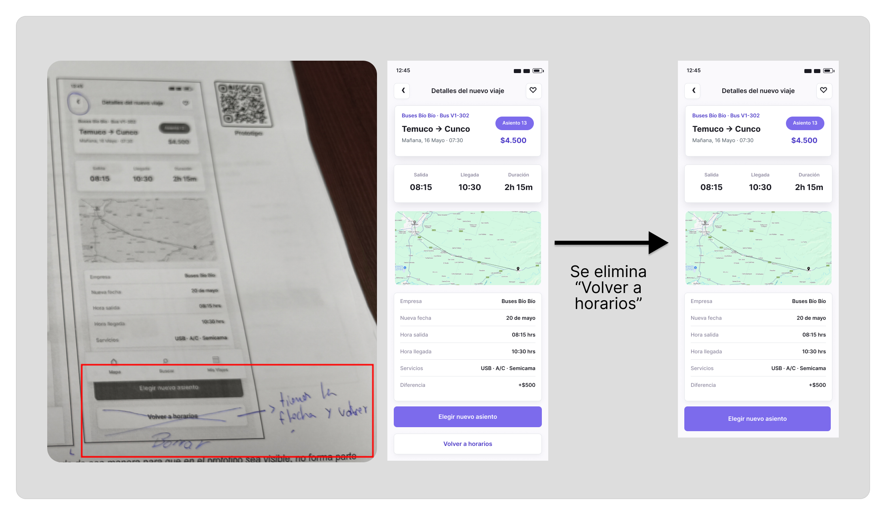

#### Standardize button size

Across the change-trip and seat-selection flow, the buttons came in different heights and widths. We resized them all to match, so the whole flow looks consistent.

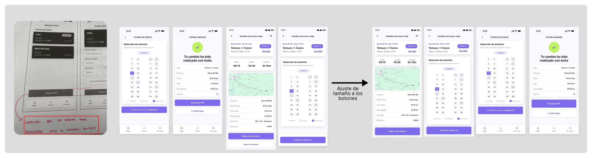

#### Remove the redundant "Volver a iniciar sesión" link

The password-recovery screen ("¿Cuál es tu cuenta?") had an extra "Volver a iniciar sesión" link that just repeated navigation already on the screen. We took it out.

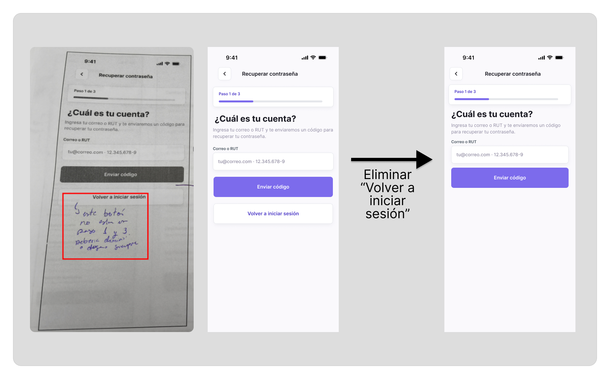

#### Remove the repeated instruction

The "Crea una nueva contraseña" screen explained the password requirements twice. We kept one clear hint and dropped the duplicate.

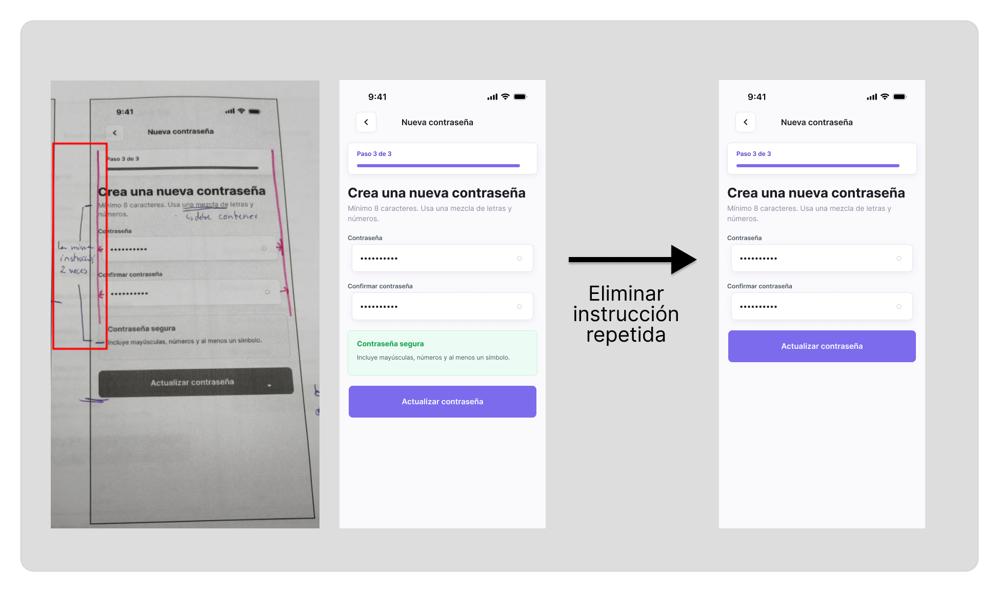

#### Align buttons to the same level

In the recovery flow, the action buttons sat at different heights from one screen to the next. We lined them all up to the same level so the flow feels steady.

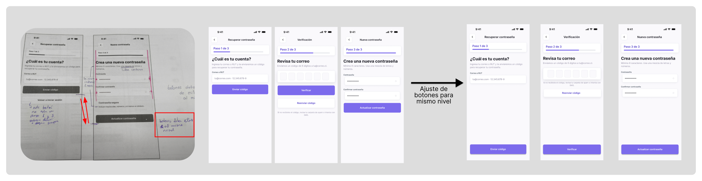

#### A more direct cancellation message

The cancellation-success message was long and roundabout ("Su cancelación ha sido realizada con éxito"). We shortened it to a plain "Has cancelado el viaje".

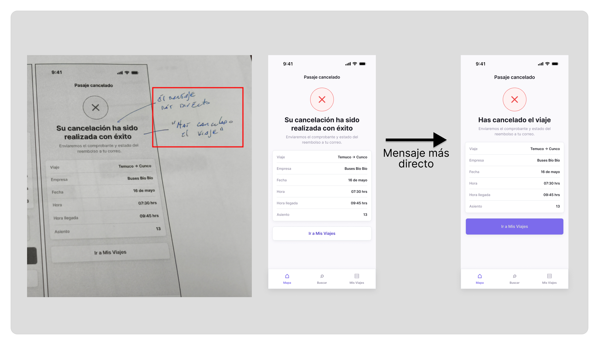

#### More direct copy on account creation

The create-account screen used wordy, indirect text. We rewrote it to be shorter and to the point.

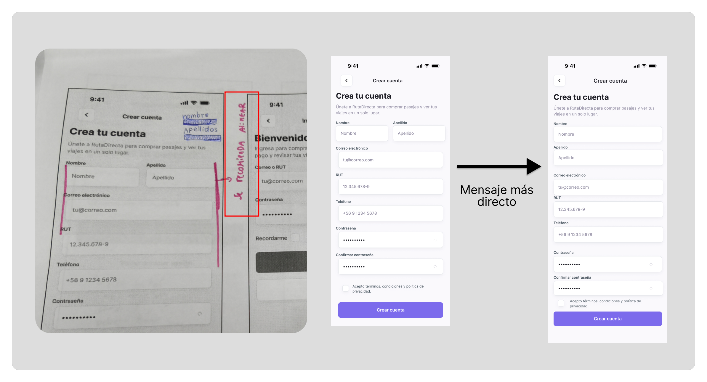

#### Redesign the ticket screen

The ticket detail screen ("Mi pasaje") was crowded with too many stacked buttons. We redesigned it with tabs and color-coded actions for changing the trip, changing the date, and cancelling, which brought the number of buttons way down.

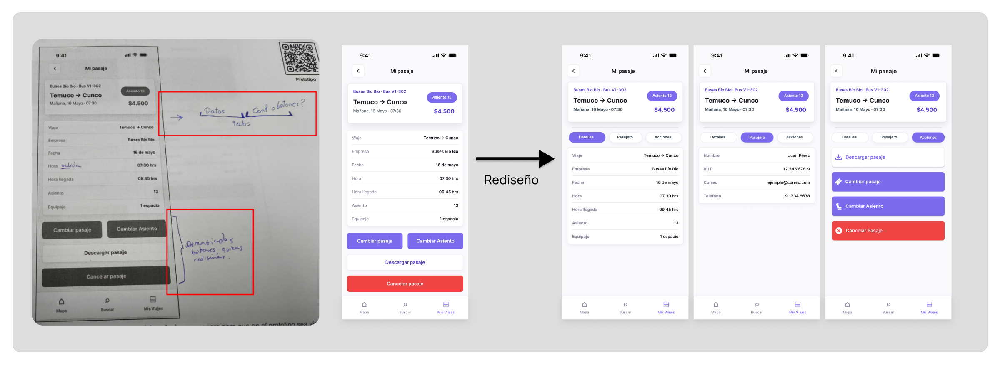

#### Clean up the purchase flow

The trip-details and seat-selection steps felt cramped and hard to read. We redesigned them into a cleaner layout that is easier to follow.

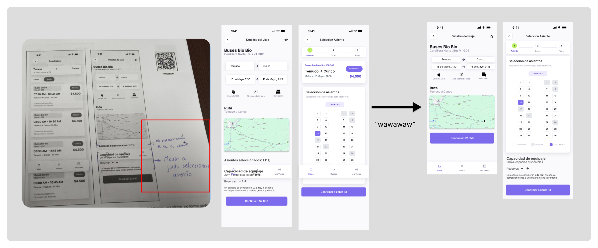

#### Remove the profile from the burger menu

The burger menu showed the user's profile in its header and again as the "Mi perfil" item. We replaced the header with the BusFinder logo and left "Mi perfil" as the only way in.

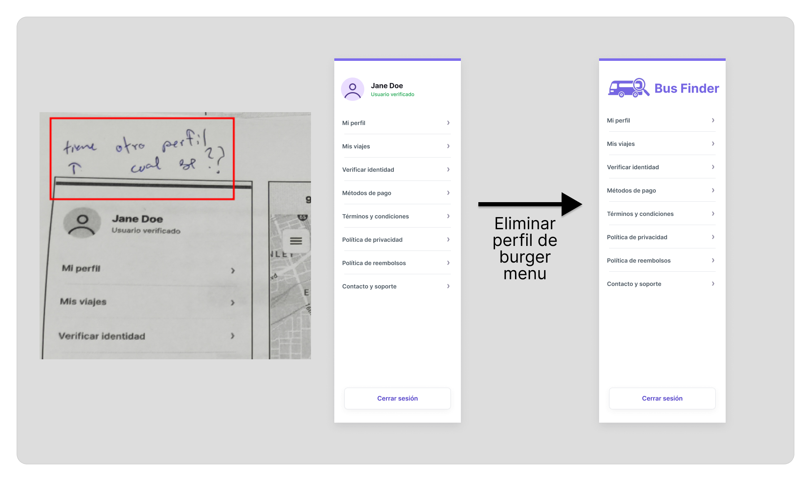

#### Hide "Verificar identidad" for verified users

The menu kept showing "Verificar identidad" even to people who were already verified. We hid the option for them.

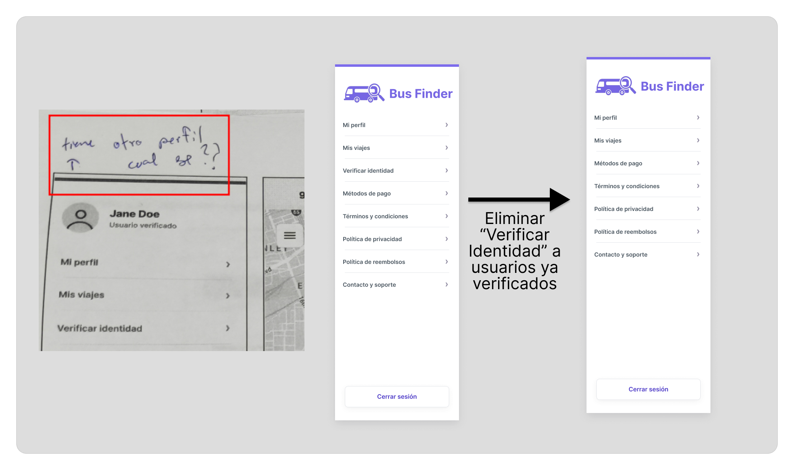

#### Restructure the profile screen

The "Mi perfil" screen was hard to scan. We gave it a new layout that groups the user's information more clearly.

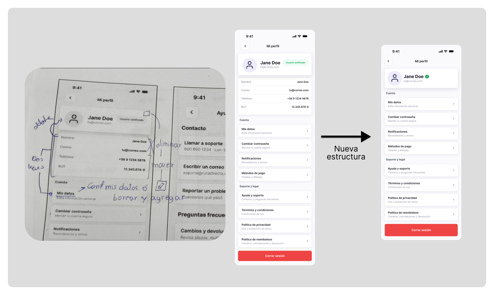

### 8.2. Heuristic Evaluation

An external team reviewed BusFinder against usability heuristics. In short, they found that password fields had no show or hide toggle, that the profile could be reached from two places at once, that the "Cerrar sesión" button blended into the menu background, that screen titles weren't centered, and that there was no way to add a new payment method. We worked through each one.

Here is each change in detail, with the problem and what we did about it.

#### Add a show/hide toggle to password fields

Password fields gave you no way to see what you were typing, so it was easy to make a mistake without noticing. We added a show and hide (eye) toggle to every password field.

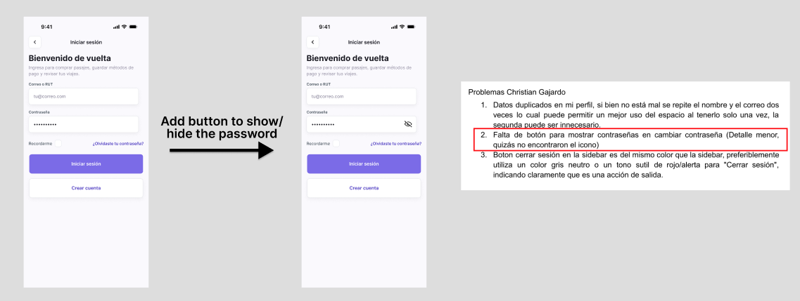

#### Remove the duplicate access to the profile

You could reach the profile from two places at once, which was redundant and a little confusing. We removed the extra entry point and kept one way in.

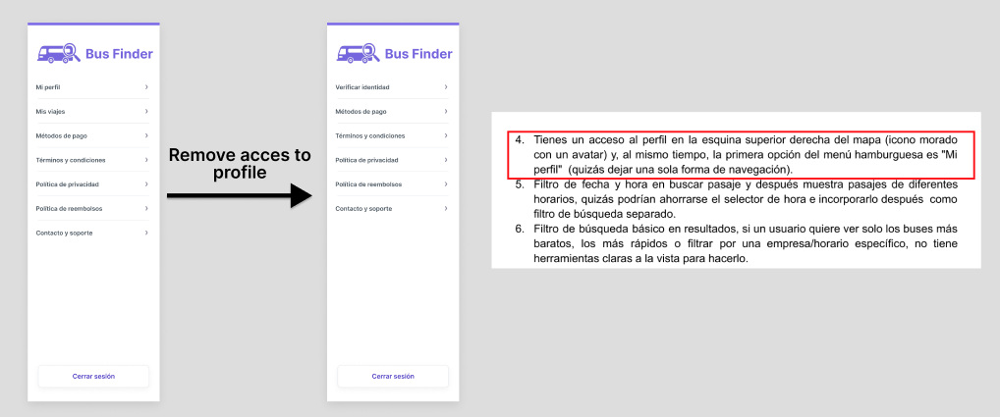

#### Make the "Cerrar sesión" button stand out

The "Cerrar sesión" (log out) button blended into the burger-menu background, so it didn't look like a button at all. We made it red so it clearly reads as an action.

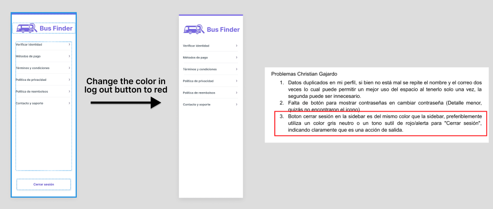

#### Center the screen titles

Screen titles were left-aligned and didn't match from one screen to the next. We centered them so they stay consistent across the app.

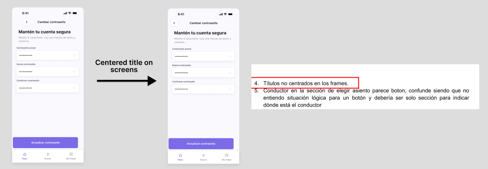

#### Add an "add payment method" button

There was no way to add a new card from the payment screen. We added an "Añadir método de pago +" button so people can register new payment methods.

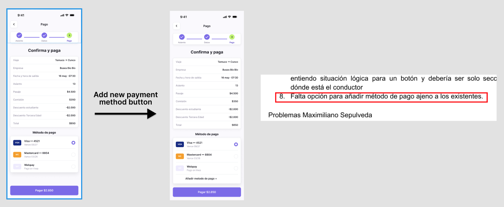

---

## 9. Accessibility

Accessibility mattered to us from the start, not as a finishing touch. Our users include seniors with low vision, students in a hurry, and rural workers who aren't all comfortable with apps, so we leaned on the WCAG guidelines and Nielsen's heuristics to keep BusFinder readable, predictable, and forgiving. Three decisions stand out.

### Navigation and flow orientation

**WCAG 2.4.6 · Nielsen #1, visibility of system status.** Multi-step flows show a three-step indicator, with a check on the steps you've finished and a number on the one you're on, so you always know where you are and how much is left. Shorter flows use a simple "Paso 1 de 3" label to do the same job.

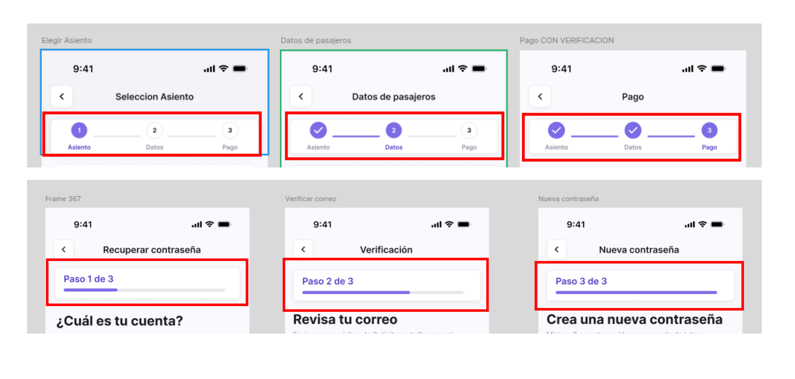

### Understanding without relying on color

**WCAG 1.4.1, use of color.** In the seat map, the *Available*, *Occupied*, and *Selected* states are shown with color **and** a text legend **and** the seat number. We never rely on color alone, so the screen still makes sense for people with color blindness or low vision.

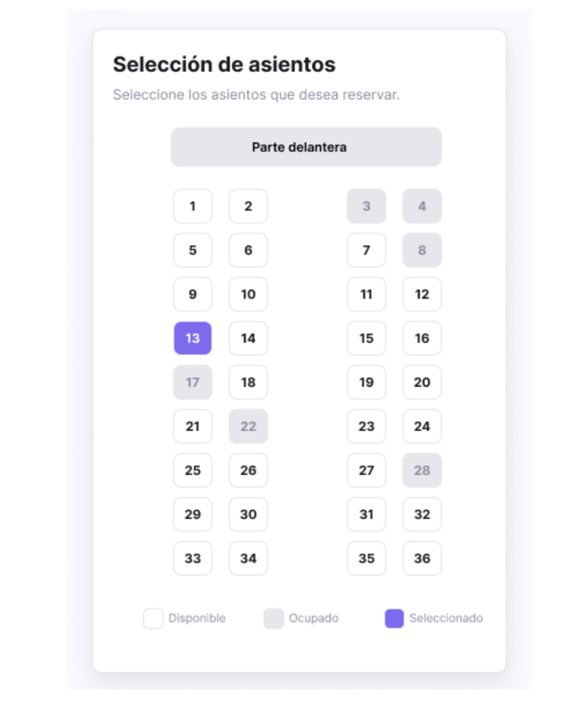

### Error prevention and user control

**WCAG 3.3.4 · Nielsen #5, error prevention.** We always warn people before an action they can't undo. Before someone confirms a cancellation or removes a card, an in-between screen recaps the details and shows an "Important" note, like the refund policy, so they have a clear chance to back out.

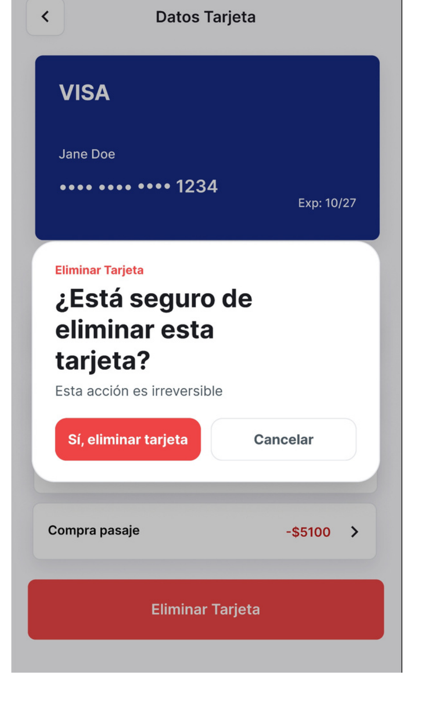

---

## 10. Conclusion

BusFinder grew out of a full UX design process, from spotting a real connectivity gap in rural Araucanía to building a high-fidelity, accessible prototype. Along the way we based our decisions on user research, personas, and benchmarking, gave the product shape through navigation flows and wireframes, and pulled it all together into one consistent visual style. Two rounds of feedback, from our tutor and from an external heuristic review, pushed the design even further, and accessibility guided the experience from the first screen to the last.

What came out of it is an app built around rural passengers, with real-time information, visible seats and luggage, clear fares, and timely notifications, all in one place.

**Thank you for reading our work!**

---
