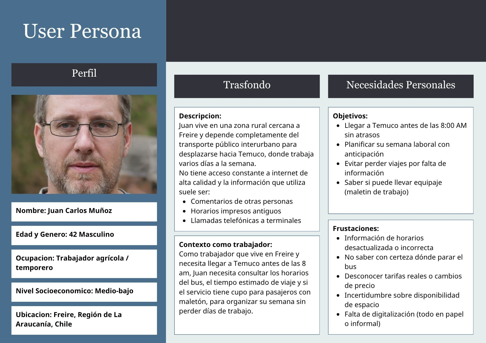
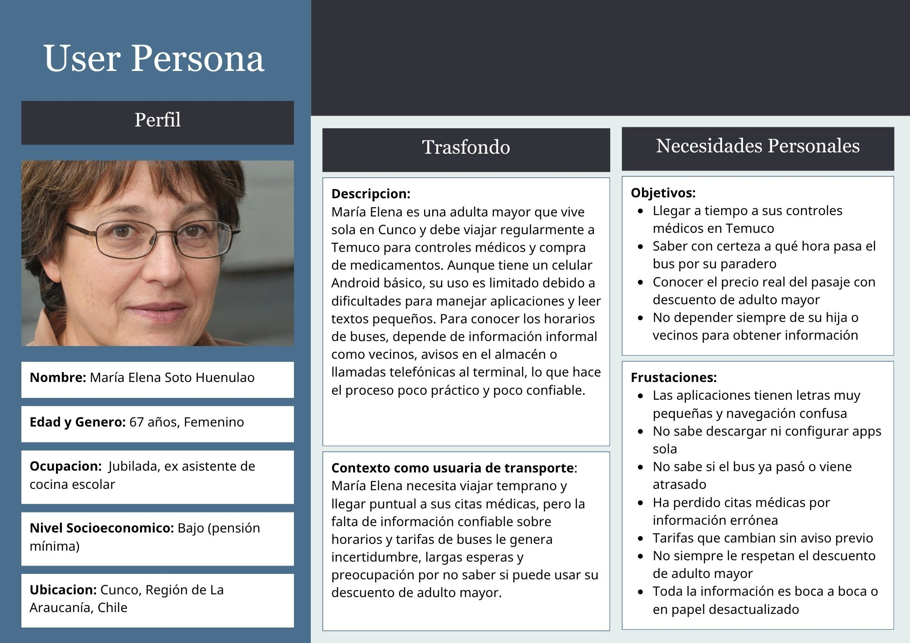
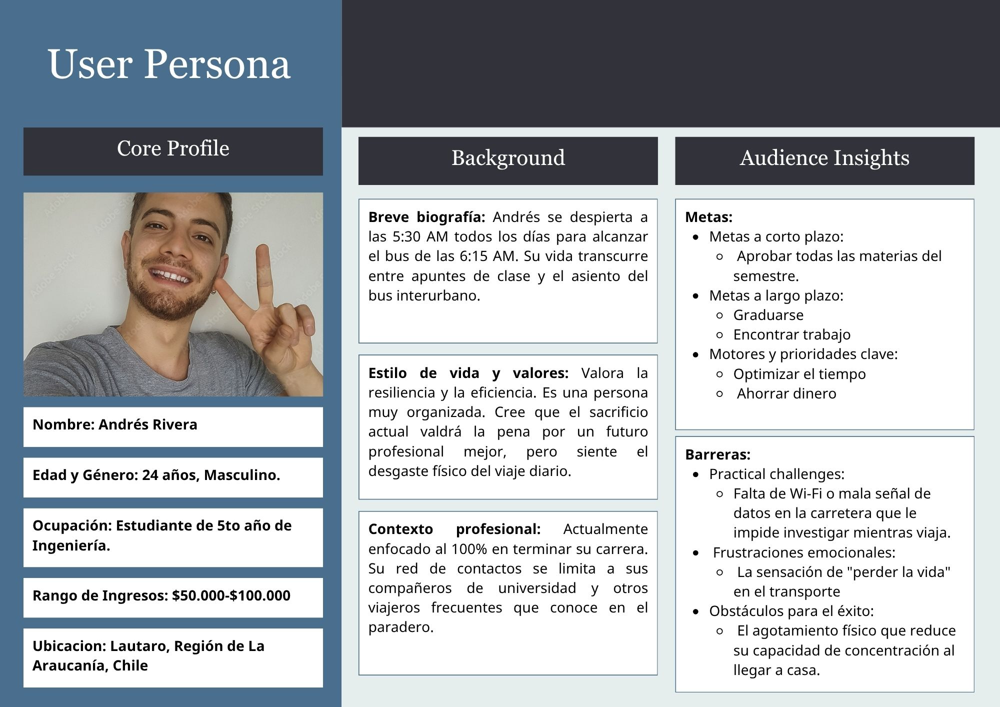
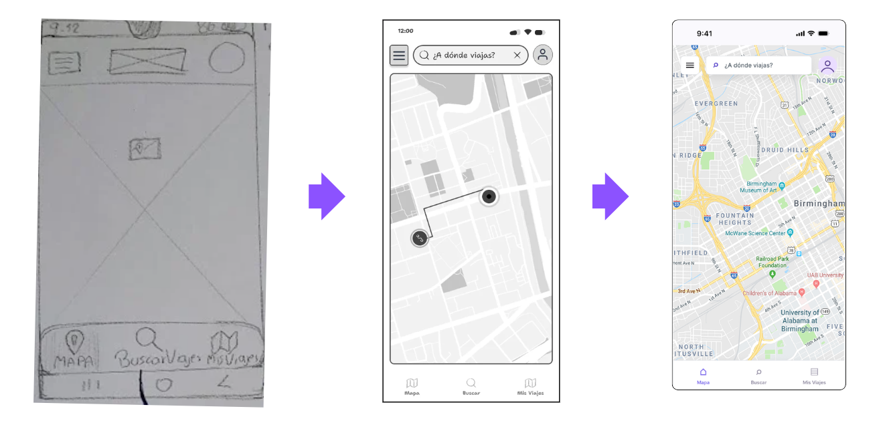
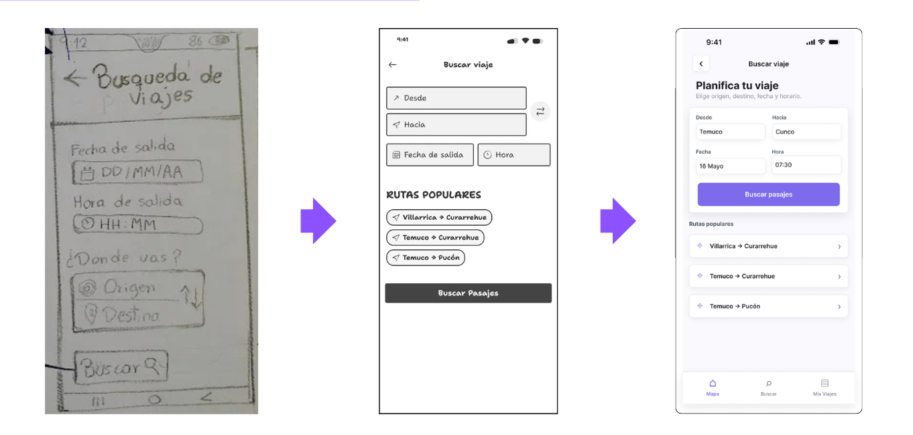
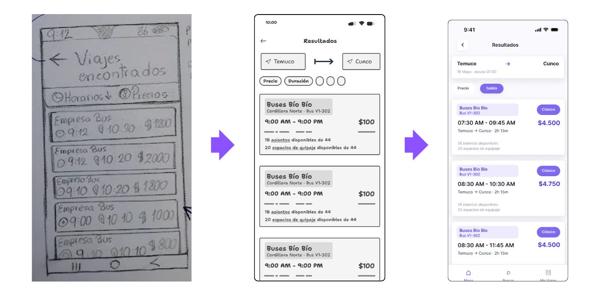
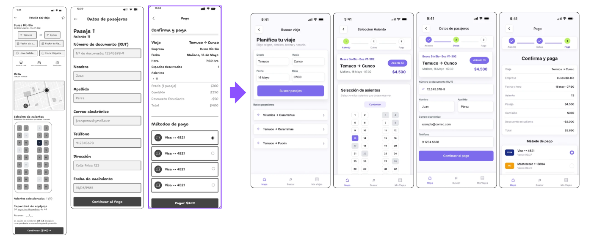
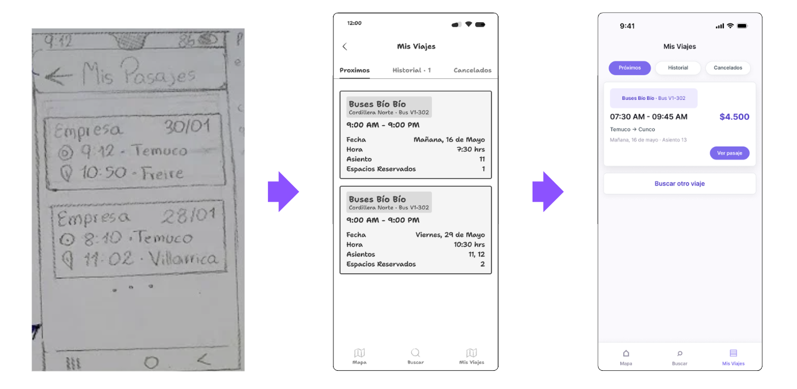
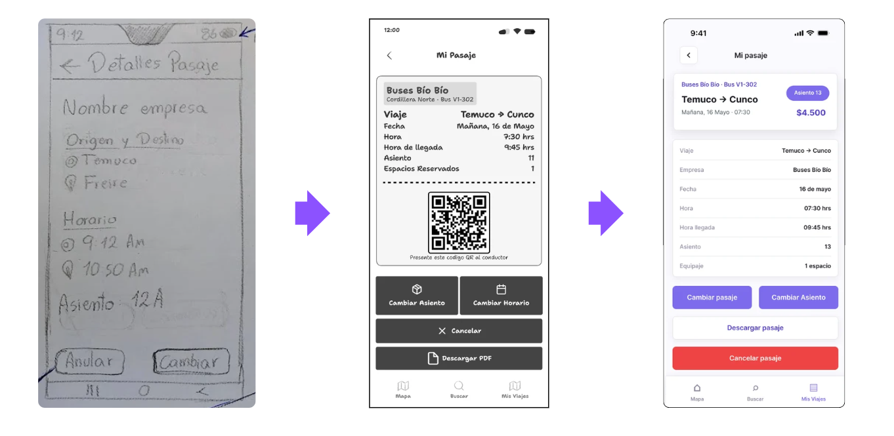
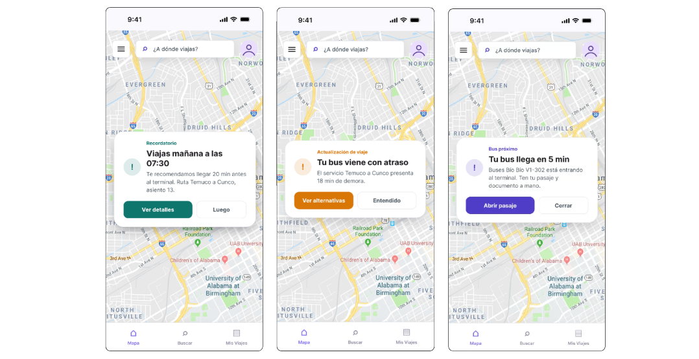

# BusFinder UXD
Connecting rural Araucanía to reliable transit, one tap at a time

## Index

- [1. Team Members and Roles](#1-team-members-and-roles)
- [2. Introduction](#2-introduction)
  - [2.1. The Problem](#21-the-problem)
  - [2.2. Our Solution](#22-our-solution)
- [3. The Strategy](#3-the-strategy)
  - [3.1. Value Proposition Canvas](#31-value-proposition-canvas)
  - [3.2. UX Personas](#32-ux-personas)
- [4. The Scope](#4-the-scope)
  - [4.1. Benchmarking](#41-benchmarking)
- [5. The Structure](#5-the-structure)
  - [5.1. Navigation Flow](#51-navigation-flow)
- [6. The Skeleton](#6-the-skeleton)
  - [6.1. Low-Fidelity Wireframes](#61-low-fidelity-wireframes)
- [7. The Surface](#7-the-surface)
  - [7.1. Interface Evolution](#71-interface-evolution)
  - [7.2. High-Fidelity Interfaces](#72-high-fidelity-interfaces)

---

## 1. Team Members and Roles

**Angelo Huaiquil** - *Project Manager*
*Coordinates the team, plans deliverables, and keeps the project aligned with its goals, scope, and deadlines.*

**Gustavo Pérez** - *Analyst*
*Researches users and requirements, leads benchmarking, and turns findings into actionable product insights.*

**Daniela Díaz** - *Designer*
*Shapes the UX/UI: personas, wireframes, navigation flows, and high-fidelity interfaces.*

---

## 2. Introduction

### 2.1. **The Problem**

The Araucanía region faces a critical mobility challenge: thousands of people in rural localities depend exclusively on **interurban bus and *micro* services** to reach essential services such as education, healthcare, and employment opportunities, all concentrated in **Temuco** and other major cities.

However, information about **routes, schedules, stops, and fares** remains **fragmented, decentralized, and often available only in physical format**. This information gap creates **significant uncertainty** that disproportionately affects **seniors, students, and rural workers**, limiting their mobility, access to opportunities, and quality of life.

> *"As a worker living in Freire who needs to reach Temuco before 8 a.m., I need to check bus schedules, the estimated travel time, and whether the service has room for passengers with large luggage, so I can plan my week without losing days of work."*

**The result: a rural population disconnected, lacking the information needed to plan their travel effectively.**

---

### 2.2. **Our Solution**

Our proposal consists of designing an intuitive mobile interface that serves as a bridge between bus operators and rural passengers in the Araucanía region. A user-centered solution that transforms the travel experience from the moment a trip is planned to the moment of arrival.
 
The proposal is built around four pillars designed to address our users' core pain points:
 
- **Real-time information hub.** Users access a clear, accessible interface that allows them to check updated schedules, estimated arrival times, and the operational status of each bus, including mechanical breakdowns. This eliminates the uncertainty that currently forces people to wait at bus stops with no assurance whatsoever, enabling them to plan their journey ahead of time, reduce the anxiety of waiting, and track their arrival time in real time.
 
- **Capacity and luggage management.** The platform provides real-time visibility into seat availability and luggage space. This directly addresses the frustration of arriving at a bus stop only to find the bus is full: users can reserve their spot and secure space for their luggage before leaving home, regaining control over their mobility.
 
- **Fare transparency and payment digitization.** The solution incorporates an advance-purchase system that automatically calculates and applies preferential fares, such as student and senior, without users losing these benefits due to lack of awareness or failure to carry physical documentation. This reduces queues at terminals, decreases cash dependency, and eliminates the friction rural passengers currently face when paying.
 
- **Smart notifications.** The application sends proactive alerts to the user's device regarding delays, route changes, or newly available seats. Rather than discovering a problem upon arrival at the bus stop, the system anticipates it, empowering users to make informed decisions and reorganize their day in time.

---

## 3. The Strategy

### 3.1. Value Proposition Canvas

The Value Proposition Canvas defines BusFinder’s fit between the needs of rural and intercity bus users in Araucanía and the services proposed by the platform.

The customer segment focuses on passengers who need to arrive on time to work, school, medical appointments, or other essential activities, while dealing with uncertainty about schedules, fares, luggage space, and bus availability. Their main pains include unreliable or fragmented schedule information, lack of fare transparency, baggage issues, and delays without prior notice.

BusFinder responds to these pains through a set of services and value creators: real-time transit alerts, estimated travel times, visible seat and luggage capacity, transparent pricing with pre-applied discounts, and push notifications for delays or newly available seats. These features aim to reduce uncertainty, improve planning, increase reliability, and make the travel experience more inclusive for rural passengers, students, workers, and seniors.

***

### 3.2. **UX Personas**  

The UX Personas represent three key user profiles affected by rural and intercity mobility issues in Araucanía. They were created to reflect different levels of digital literacy, travel frequency, and dependency on public transport.

Together, these personas help guide BusFinder’s design decisions by highlighting the need for reliable route information, accessible interfaces, clear fare visibility, real-time alerts, and reduced uncertainty before and during the trip. Their needs directly inform the product’s main features, such as live bus tracking, capacity and luggage visibility, fare transparency, and proactive notifications.

Each persona represents a different mobility scenario: daily commuting, essential healthcare travel, and academic travel between rural towns and urban centers.

---

👥🔹 **Juan Carlos Muñoz (42, Male)**
*Agricultural worker from Freire who depends entirely on intercity buses to commute to Temuco. He relies on outdated printed schedules and word-of-mouth, and faces constant uncertainty about bus times, fares, and luggage capacity.*

---

👥🔹 **Maria Elena Soto Huenulao (67, Female)**
*Retired senior living alone in Cunco who travels regularly to Temuco for medical appointments. She struggles with small text and confusing app navigation, and has missed appointments due to unreliable bus information.*

---

👥🔹 **Andres Rivera (24, Male)**
*5th-year Engineering student from Lautaro who wakes at 5:30 AM daily to catch the 6:15 bus. He values efficiency and time optimization but feels physically drained by the daily commute and lack of reliable transit data.*

---

## 4. The Scope

### 4.1. Benchmarking

The benchmark compares **TurBus**, **Moovit**, and **Uber** to identify mobility UX patterns that can inform BusFinder. TurBus provides a direct reference for intercity bus ticket purchase and seat selection; Moovit contributes public transport route planning, live guidance, and service alerts; and Uber works as a design reference for map-centered tracking, ETA visibility, and fare transparency.

From this analysis, BusFinder prioritizes a **search-first flow**, **clear route comparison**, **real-time or estimated bus tracking**, **fare transparency**, and **capacity/luggage visibility**. The benchmark also defines what the project should avoid, such as intrusive ads, mandatory sign-up before basic use, hidden luggage information, and overloaded navigation.

> The **detailed analysis** lives in the **Benchmark BusFinder** document. This README presents only the files and resources that **synthesize** that analysis: the feature map and comparative summary tables below.

**Full benchmark document:** [Benchmark BusFinder](./Docs/Benchmark%20BusFinder.pdf)

#### Feature Map

#### Comparative Summary Table

---

## 5. The Structure

### 5.1. Navigation Flow

The navigation flow is represented through the BusFinder site map diagram, showing the main app areas and how users move between search, live map, trip management, profile, payment, verification, and support flows.

---

## 6. The Skeleton

### 6.1. Low-Fidelity Wireframes

The low-fidelity wireframes document the core mobile screens and interaction paths for planning, selecting, paying for, managing, and modifying trips in BusFinder.

The preview above shows three representative wireframes. The complete low-fi wireframe set is available in the PDF and Figma links below.

**Low-fi wireframes document:** [Low-Fi Wireframes - PDF](./Docs/Low-Fi%20Wireframes.pdf)

**Figma file:** [Low-Fi Wireframes - Figma](https://www.figma.com/design/ZrcgdOga1rsxqB9vF9FUYD/Act-Lunes-27-Abril-UIX?node-id=0-1&t=ouVhxJIyy2qqlC2H-1)

---

## 7. The Surface

The surface layer brings BusFinder to life: it defines the visual design (color, typography, iconography, spacing, and components) and turns the low-fidelity wireframes into polished, high-fidelity interfaces. This is where the look and feel, accessibility, and overall sensory experience of the app take final shape.

**Figma file:** [BusFinder UIX - High-Fidelity Interfaces](https://www.figma.com/design/ZrcgdOga1rsxqB9vF9FUYD/BusFinder-UIX?node-id=298-159&t=XmYar2kFvUV8Uq2E-1)

### 7.1. Interface Evolution

This section describes the main changes each screen went through, from the very first iterations to the final design. Across the board, BusFinder evolved through three fidelity stages: **hand-drawn low-fidelity sketches** that fixed layout and content priorities, **grayscale mid-fidelity wireframes** that refined structure, hierarchy, and interaction patterns, and **high-fidelity interfaces** that applied BusFinder's visual identity: its purple accent color, consistent typography and iconography, real content, and a persistent bottom navigation. The summary below walks through the key changes per screen.

#### Main Menu (Home)

The home moved from an abstract sketch (a placeholder map area with floating buttons) to a structured wireframe centered on a map with a top search bar, and finally to a high-fidelity, map-first home with an interactive map and a prominent "¿A dónde viajas?" search. Search became the focal point of the experience.

#### Search Trip (Buscar Viaje)

The search form went from a basic From/To with date and time fields to a wireframe that introduced a swap control and a **Popular Routes** shortcut, and finally to a high-fidelity screen with a friendly "Planifica tu viaje" heading, pre-filled fields, a purple primary action, popular routes as a tappable list, and bottom navigation.

#### Search Results (Resultados de Búsqueda)

Results evolved from a plain stacked list of trips into comparable cards: the mid-fidelity stage added **filtering and sorting** controls and richer cards (company, route, departure/arrival, price), and the final design emphasized price, applied consistent typography, and kept the comparison scannable.

#### Buy Ticket (Comprar Pasaje)

The purchase flow was broken into explicit steps. It evolved from a compact mid-fidelity sequence (trip data with a seat grid, passenger form, and payment confirmation) into a clear high-fidelity flow: **plan trip → seat selection → passenger data → payment & confirmation**, with a visual seat map, cleaner forms, and a payment summary showing the available methods.

#### My Tickets (Mis Viajes)

The trips list moved from a plain list of tickets to a screen organized with **tabs (Próximas / Historial / Cancelados)** and detailed cards, ending in a polished high-fidelity version with clear per-trip actions ("Ver pasaje") and a "Buscar otro viaje" shortcut.

#### Ticket Detail (Detalle Pasaje)

The ticket detail went from a text-only list of fields with "Anular/Cambiar" buttons to a wireframe that introduced a **QR boarding code** and reserved-space info, and finally to a high-fidelity screen with a structured detail list, a seat badge, and **color-coded actions**: purple for primary changes and red for the destructive "Cancelar pasaje".

#### Home Notifications (Notificaciones)

The smart-notification system is surfaced over the map home and evolves across states (a proactive alert, a delay warning, and an arrival confirmation), each **color-coded by urgency** with a clear action, keeping users informed without leaving the home screen.

There are many more examples of this. We invite you to explore the Figma designs to see the evolution of our work:

- **Low-fidelity wireframes:** [Figma file](https://www.figma.com/design/ZrcgdOga1rsxqB9vF9FUYD/Act-Lunes-27-Abril-UIX?node-id=0-1&t=ouVhxJIyy2qqlC2H-1)
- **High-fidelity interfaces:** [Figma file](https://www.figma.com/design/ZrcgdOga1rsxqB9vF9FUYD/BusFinder-UIX?node-id=298-159&t=XmYar2kFvUV8Uq2E-1)

### 7.2. High-Fidelity Interfaces

While the previous section traced how the main screens evolved, here we highlight other high-fidelity frames that were **not** covered in that evolution: screens that had no low-fidelity counterpart and were designed directly in high fidelity, along with complete flows (such as changing or cancelling a ticket) that took shape as the product matured. Screens that existed in low fidelity but were dropped before high fidelity are intentionally left out.

#### Change Ticket Flow (Cambiar pasaje)

A full flow added in high fidelity for users who need to modify a trip already purchased. The user picks a **new date** on a calendar, chooses a **new schedule** from the available departures (with price and sorting), and **reviews the new trip details** (route, times, and amenities). They then select a **new seat** through the stepped seat picker, and finally land on a **success confirmation** with the updated trip summary, a PDF download, and a shortcut back to "Mis Viajes".

#### Cancellation Flow (Cancelación)

A two-step flow that protects against accidental cancellations. First, a confirmation screen restates the trip details, warns that refunds follow the original company's policy, and offers a clear destructive action ("Sí, cancelar") alongside a safe way out ("Mantener pasaje"). Once confirmed, a **success screen** acknowledges the cancellation and notes that the receipt and refund status will be sent by email, with a shortcut back to "Mis Viajes".

#### Payment Methods (Métodos de pago)

The payment area groups the card-related screens. **Métodos de pago** lists the saved cards with a default badge and expiry date; tapping a card opens **Datos Tarjeta**, which shows the card together with its movement history and an option to delete it; and **Agregar tarjeta** provides the form to register a new card (number, name, expiry, CVV) and optionally set it as the default. Together they support the fare-transparency and payment-digitization pillar.

#### Navigation Menu (Burger Menu)

A side menu that ties the new areas together, giving quick access to profile, trips, identity verification, payment methods, legal documents, support, and logout.

---
